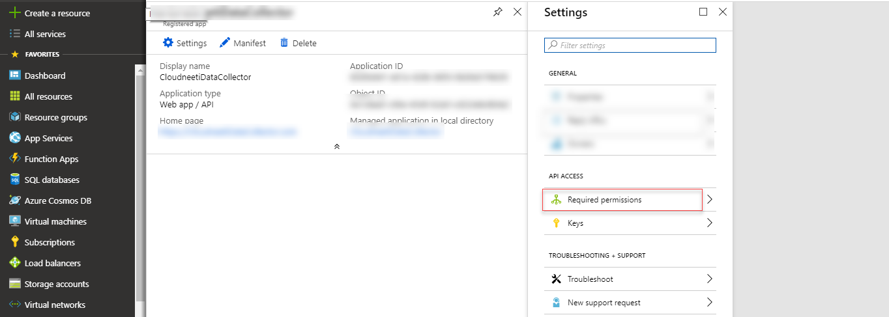
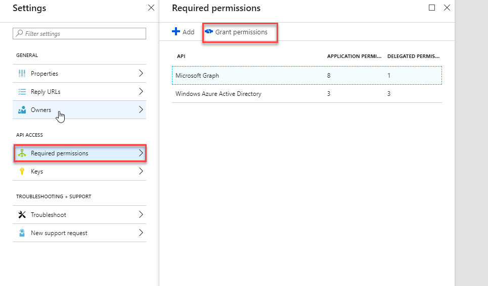

# Create Service Prinicipal

## **Prerequisite:**

- Open PowerShell as administrator (right click on PowerShell and select run as administrator)
- Download the **Create-ServicePrincipal** script from [`here`](https://github.com/AvyanConsultingCorp/docs_cloudneeti/blob/master/scripts/Create-ServicePrincipal.ps1)
- **PowerShell version should be 5 or above**
To check PowerShell version type `$PSVersionTable.PSVersion` in PowerShell and you will find PowerShell version, below example version is 5.1.17134.228.

If PowerShell version is lower than 5 then follow link https://docs.microsoft.com/en-us/powershell/scripting/setup/installing-windows-powershell?view=powershell-6

- **AzureAD module installed**
To check Azure AD version type `Get-InstalledModule -Name azureAD` in PowerShell window
 
If version is lower or not installed, type command `Install-Module -Name AzureAD -MinimumVersion 2.0.0.131` in PowerShell window

**Note:**
1. 	Part 1 describes, if service principal with name **Cloudneeti-Data-Collector** was never created in Azure Active Directory > App Registration
2. 	Part 2 describes, if service principal with name **Cloudneeti-Data-Collector** exists in Azure Active Directory > App Registration

## **Part1**
### Follow steps given below to create service principal
1.	Open PowerShell in **administrator** mode
2.	Move to the path where `Create-ServicePrincipal.PS1` file is kept (e.d “cd C:\ )
3.	Run file named **Create-ServicePrincipal.ps1** (e.g `.\Create-ServicePrincipal.ps1`)
Parameters will be 
1.	**azureActiveDirectoryTenantId** : Directory ID is Tenant ID and can be found in Azure Active Directory
2.	**replyURL** : URL where authentication response need to be sent e.g. "DNSname.region.cloudapp.azure.com/Account/Signin"
3.  **expirationPeriod** : expiration period of secret key
 
**Note:**
 You can also add number of years for the life of key should live, by simply adding parameter `-expirationPeriod` followed by number by default key life is 1 year
e.g:
 
 It takes following parameters
 - `azureActiveDirectoryTenantId` : Azure Active Directory Id
 - `replyUrl`: Reply URL like `DomainName/Account/SignIn`
 - `expirationPeriod`: Number of years for which the secret key will be valid eg. 1
error: 
- If you get error like: `<script>.ps1` is not digitally signed.  The script will not execute on the system.”
Run command `Set-ExecutionPolicy -Scope Process -ExecutionPolicy Bypass` in your PowerShell window and try again
- If you get error “The term `Install-Module` is not recognized” install PowerShell version 5 or greater, link shared in prerequisite of this document 

4.	Login screen will be prompted
  
**Note:** Credentials used should have AD role as ‘Global Admin’
5.	Service principal is created, save ‘ApplicationName’ , ‘ApplicationId’, ‘Password Key Description’ and ‘Password Key’
 

Find count of 'Application Permissions' and 'Delegated Permissions' with respect to 'API'
 

6.	To verify, Login to Azure portal > Azure Active Directory > App registrations
 

7.	Search for service principal with respective name
 
8.	In Settings check Reply URLs and Required permissions
 

9.	To grant permission, in settings > required permissions > click on Grant permissions then ok
Refer below images 

    To grant permissions listed above click on Grant permission.

10.	Service principal created successfully 

## **Part 2**

1.	If service principal with respective name already exists then script will ask you whether you want to create new key for the existing or not
 
2.	Enter your choice, if you enter ‘yes’, new key will be created, save the details i.e ApplicationName’ , ‘ApplicationId’, ‘Password Key Description’ and ‘Password Key’
