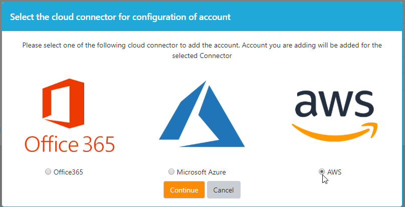

# Onboard an AWS account

* Follow these steps to onboard an AWS account to Cloudneeti.

**Prerequisite:**
-----------------

1.  PowerShell : 

    1.  Windows PowerShell version 5 and above

    2.  To check PowerShell version type `$PSVersionTable.PSVersion` in
        PowerShell and you will find PowerShell version.

-  To install PowerShell follow the [`link`](https://docs.microsoft.com/en-us/powershell/scripting/setup/installing-windows-powershell?view=powershell-6)

2.  AWS cli

    2.1.  To check AWS cli is configured type aws on PowerShell.

    2.2.  To install AWS cli follow link
        <https://docs.aws.amazon.com/cli/latest/userguide/install-windows.html>

>   D:\\AWS onboarding Deck\\aws in PS.png

3.  npm: npm is a package manager for the JavaScript programming language and
    consists of a command line client.

    3.1.  To install npm follow the [`link`](https://www.npmjs.com/get-npm)

    3.2.  Serverless Framework: Serverless Framework is
    a [`Node.js`](https://nodejs.org/) CLI tool 

    3.2.1.  To check serverless is configured type serverless on Powershell

    3.2.2.  Install serverless framework using “npm install -g serverless”

4.  AWS root account access key id and secret : Before you configure the
    Cloudneeti on to your AWS account, you need an AWS root account access key
    id and secret.

    4.1.  Getting AWS account access key id and secret

        4.1.1.  Sign into your [AWS
            Account](https://www.amazon.com/ap/signin?openid.assoc_handle=aws&openid.return_to=https%3A%2F%2Fportal.aws.amazon.com%2Fgp%2Faws%2Fdeveloper%2Fregistration%2Findex.html%3Fie%3DUTF8%26nc1%3Dh_ct&openid.mode=checkid_setup&openid.ns=http%3A%2F%2Fspecs.openid.net%2Fauth%2F2.0&openid.identity=http%3A%2F%2Fspecs.openid.net%2Fauth%2F2.0%2Fidentifier_select&openid.claimed_id=http%3A%2F%2Fspecs.openid.net%2Fauth%2F2.0%2Fidentifier_select&action=&disableCorpSignUp=&clientContext=&marketPlaceId=&poolName=&authCookies=&pageId=aws.ssop&siteState=awscustomer&accountStatusPolicy=P1&sso=&openid.pape.preferred_auth_policies=MultifactorPhysical&openid.pape.max_auth_age=3600&openid.ns.pape=http%3A%2F%2Fspecs.openid.net%2Fextensions%2Fpape%2F1.0&server=%2Fap%2Fsignin%3Fie%3DUTF8&accountPoolAlias=&forceMobileApp=0&forceMobileLayout=0).

        4.1.2.  Click your name located on the top right navigation pane.

        4.1.3.  Select “My Security Credentials”. 

        4.1.4.  Access key id is under the section “Access keys for CLI, SDK, & API
            access”

        4.1.5.  If access key secret is not recorded for this id, please create a
            new access key by clicking on “Create access key” button.

**Steps:**

-  Create a Role to mark Cloudneeti's account as a trusted entity with the
    SecurityAudit access policy.

    1.  Click the -> [`link`](https://raw.githubusercontent.com/AvyanConsultingCorp/docs_cloudneeti/master/scripts/serverless.yml) and save its content in “serverless.yml” file.

    2.  Open PowerShell as administrator (right click on PowerShell and select
        run as administrator)

    3.  In PowerShell navigate to file location “serverless.yml” file is (e.g.
        “cd C:\\”)

    4.  Type “aws configure” and enter Account access key id, secret
        access key of an AWS IAM User (with Admin Access Permission) and default region name(eg. us-east-1). Give default output format as "json"
        only.

    5.  To add Cloudneeti data provisioning resource, execute the command
        “serverless deploy”

        

    6.  A Role will be created in the customer's account to mark Cloudneeti's
        account as a trusted entity with the SecurityAudit access policy.

        1.  For details about SecurityAudit access policy, please refer below
            link:

            <a href='https://console.aws.amazon.com/iam/home?region=us-east-2#/policies/arn:aws:iam::aws:policy/SecurityAudit$serviceLevelSummary' target='_blank'>https://console.aws.amazon.com/iam/home?region=us-east-2#/policies/arn:aws:iam::aws:policy/SecurityAudit$serviceLevelSummary</a >

    7.  On Cloudneeti portal, navigate to Settings -\> Manage Account

    

    7.1.  Click on Add Cloud Account button

    7.2.  Select appropriate license

    7.3.  Choose connector type as AWS and click on Continue

    

    7.4.  Enter details Account Name, AWS Account Id

   -  Getting AWS Account Id

        1.  Sign into your [`AWS Account`](https://www.amazon.com/ap/signin?openid.assoc_handle=aws&openid.return_to=https%3A%2F%2Fportal.aws.amazon.com%2Fgp%2Faws%2Fdeveloper%2Fregistration%2Findex.html%3Fie%3DUTF8%26nc1%3Dh_ct&openid.mode=checkid_setup&openid.ns=http%3A%2F%2Fspecs.openid.net%2Fauth%2F2.0&openid.identity=http%3A%2F%2Fspecs.openid.net%2Fauth%2F2.0%2Fidentifier_select&openid.claimed_id=http%3A%2F%2Fspecs.openid.net%2Fauth%2F2.0%2Fidentifier_select&action=&disableCorpSignUp=&clientContext=&marketPlaceId=&poolName=&authCookies=&pageId=aws.ssop&siteState=awscustomer&accountStatusPolicy=P1&sso=&openid.pape.preferred_auth_policies=MultifactorPhysical&openid.pape.max_auth_age=3600&openid.ns.pape=http%3A%2F%2Fspecs.openid.net%2Fextensions%2Fpape%2F1.0&server=%2Fap%2Fsignin%3Fie%3DUTF8&accountPoolAlias=&forceMobileApp=0&forceMobileLayout=0).

        2.  Click your name located on the top right navigation pane.

        3.  Select “My Account”. 

        4.  Your AWS ID is the twelve-digit number located underneath the
            Account Settings section.

    8.  Activate the account and configure Data Collection by entering time and time zone.
